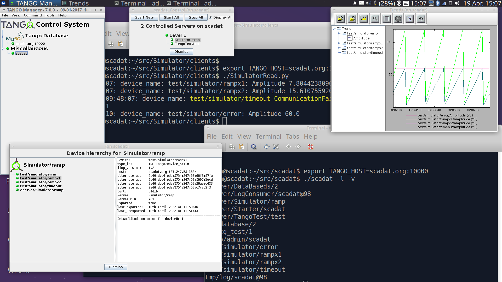

<html><body>
Command line interface to <a href="https://tango-controls.readthedocs.io/en/latest/installation/tango-on-linux.html">Tango</a>

scadat -h

<pre>
Usage: [-h] [-v] [-t T] [ -l | -r R [R ...] | -a A [A] | -c C [C] | -p P [P]]

Command line interface to TANGO_HOST. (default: export TANGO_HOST=localhost:10000)

optional arguments:
  -h            show this help message and exit
  -v            increase verbosity using -v,-vv,-vvv
  -l            List tango devices
  -r R [R...]   Read attributes,commands and properties for devices: e.g. scadat -r sys/tg_test/1
  -a A [A]      Write attributes: e.g.
                scadat -a sys/tg_test/1/string_scalar 'hello world'
  -c C [C]      Write commands: e.g.
                scadat -c sys/tg_test/1/DevLong 1234
  -p P [P]      Write properties: e.g.
                scadat -p sys/tg_test/1/myproperty test

<a href="https://tango-controls.readthedocs.io/en/latest/installation/tango-on-linux.html">Install Tango</a> on debian or ubuntu
---------------------------
apt install mariadb-server

vi /etc/mysql/my.cnf
[client]
user=mysqluser
password=mysqlpass

apt install tango-db tango-test python-pytango

Install scadat
---------------------------
git clone https://github.com/martinmohan/scadat
cd scadat
./scadat -h

Test
-------
cd test  
./scadat_test.sh

A sample server is available at <a href="https://github.com/MartinMohan/Simulator">Simulator</a> 

 
</pre>
</body></html>
